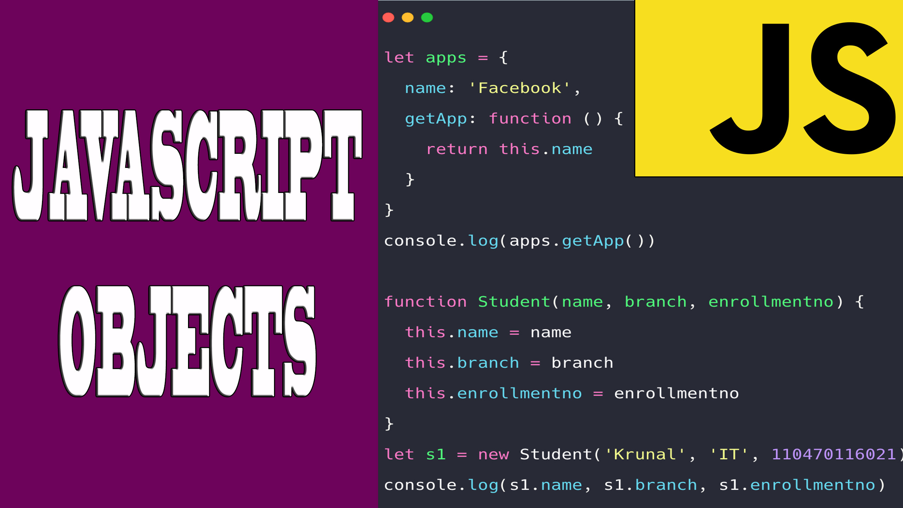
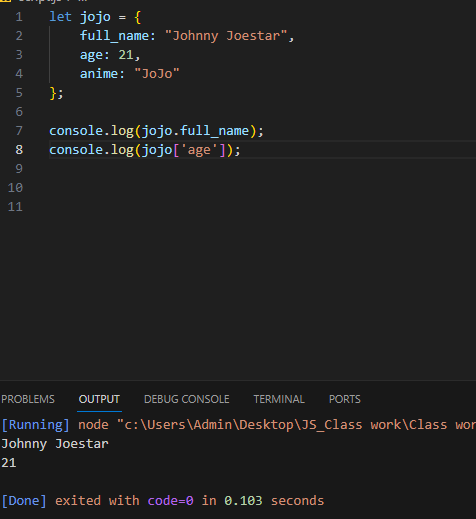
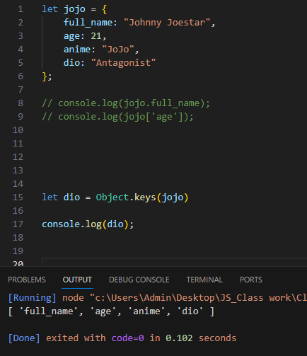
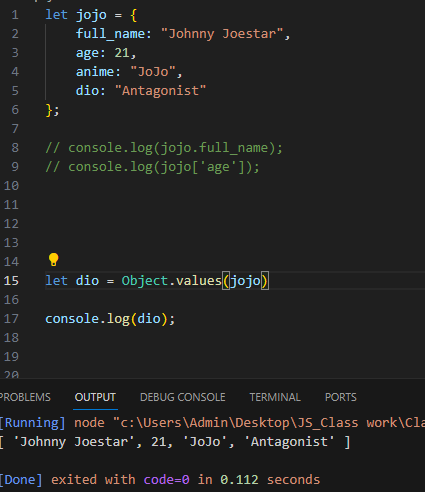
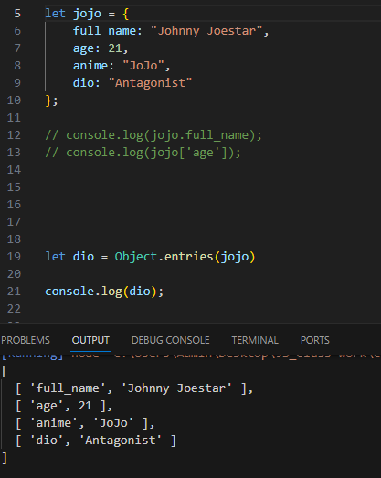
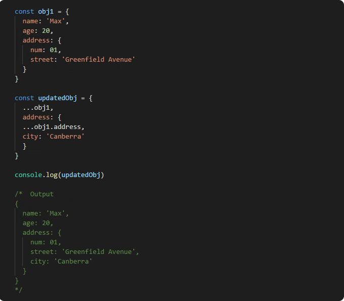
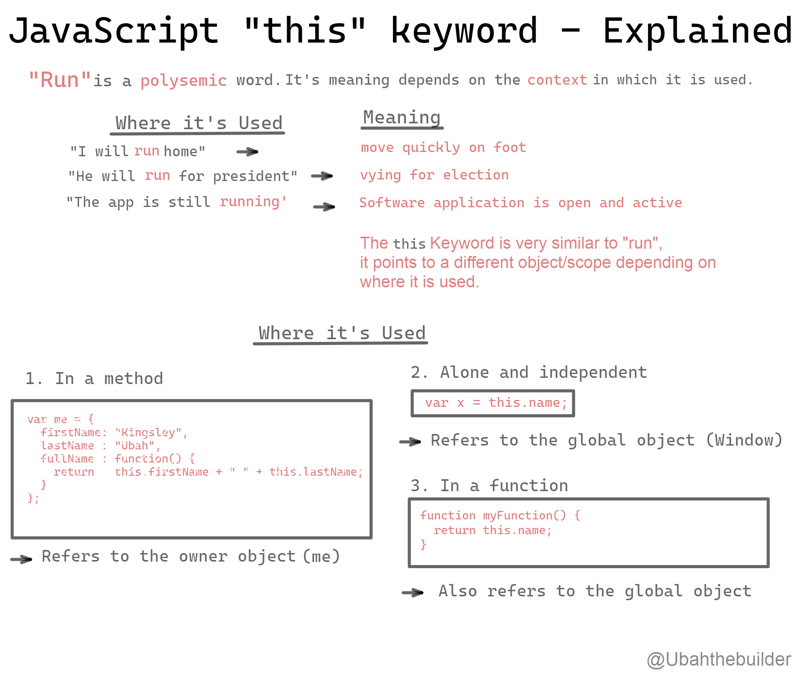

# What is Object in JavaScript?
## An object is a collection of properties, and a property is an association between a name (or key) and a value. A property's value can be a function, in which case the property is known as a method. Objects in JavaScript, just as in many other programming languages, can be compared to objects in real life. In JavaScript, an object is a stand alone entity, with properties and type.Compare it with a cup, for example. A cup is an object, with properties. A cup has a color, a design, weight, a material it is made of, etc. The same way, JavaScript objects can have properties, which define their characteristics.Everything is an object in JavaScript.

# Create object
## JavaScript objectis a nonprimitive data-type that allows you to store multiple collections of data. Objects in JS are represented as key-value pairs. The key is the name of the property or method, and the value can be any value including another object. To create an object in JavaScript, you can use curly braces {}:

# Methods object

# 1) Method keys
## JavaScript Object keys() Method. JavaScript Object. keys() function is used to return an array whose elements are strings corresponding to the enumerable properties found directly upon an object. The ordering of the properties is the same as that given by the object manually in a loop applied to the properties.

# 2) Method values

## JavaScript Object values() Method. JavaScript object. values() method is used to return an array whose elements are the enumerable property values found on the object. The ordering of the properties is the same as that given by the object manually if a loop is applied to the properties.

# 3) Metod entries

## JavaScript Object. entries() method is used to return an array consisting of enumerable property [key, value] pairs of the object which are passed as the parameter. The ordering of the properties is the same as that given by looping over the property values of the object manually.

# What is Destructuring and Spread OBJECTS in JavaScript?

## Destructuring is used to create varibles from array items or object properties. Spread syntax is used to unpack iterables such as arrays, objects, and function calls. Rest parameter syntax will create an array from an indefinite number of values.12

>

# What is keyword " this "  in JavaScript ?

## Fig: JavaScript “this” keyword. “This” keyword refers to an object that is executing the current piece of code. It references the object that is executing the current function. If the function being referenced is a regular function, “this” references the global object

